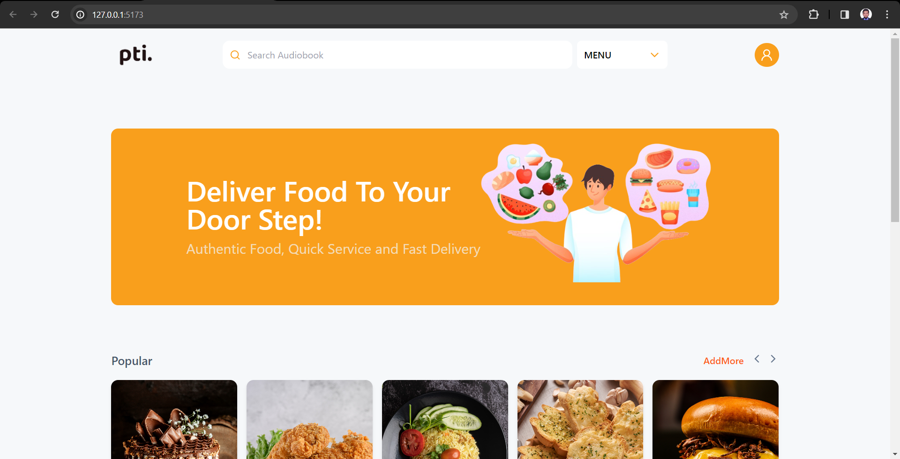

# Quad Theory Task
Pti is a React app that makes buying and selling delicious food products a breeze!

## How to run

### Step: 1
Clone the repository or download
```
git clone https://github.com/Minhaz312/qt-task.git
```
### Step: 2
Install necessary packages using following command
```
npm install
```
### Step: 3
Run the app using following command
```
npm run dev
```

## After running the app
you can browse http://127.0.0.1:5173 link

#### Output


